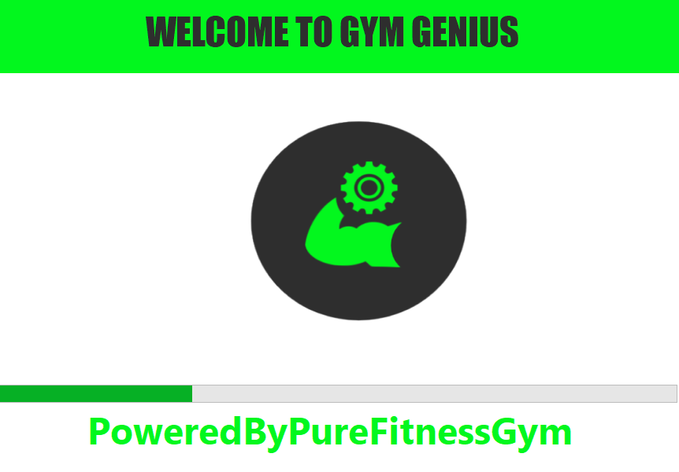
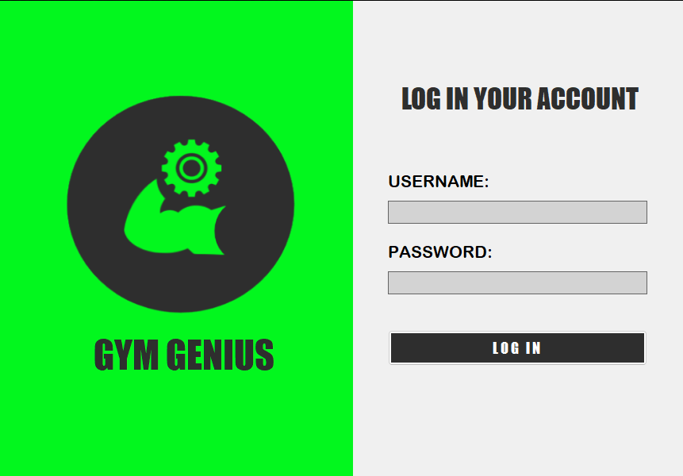
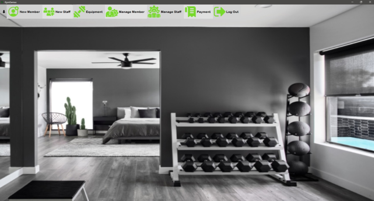
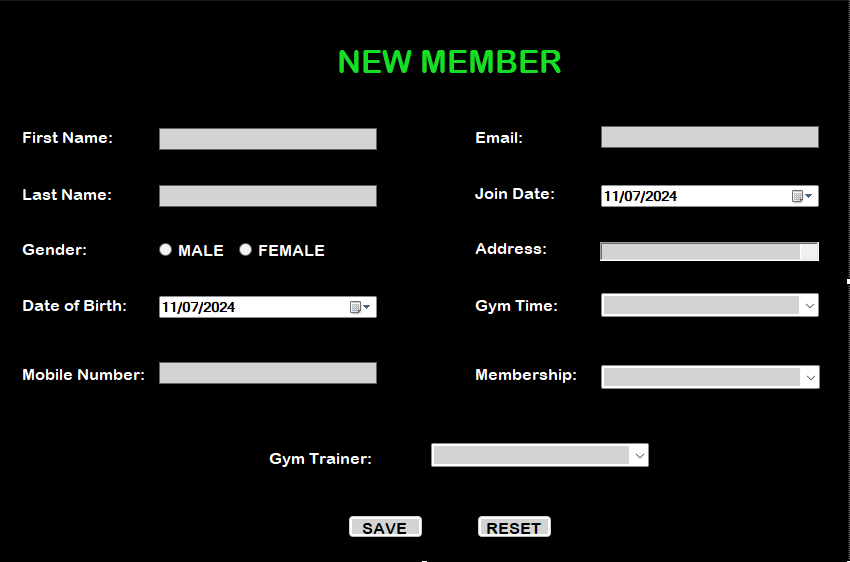
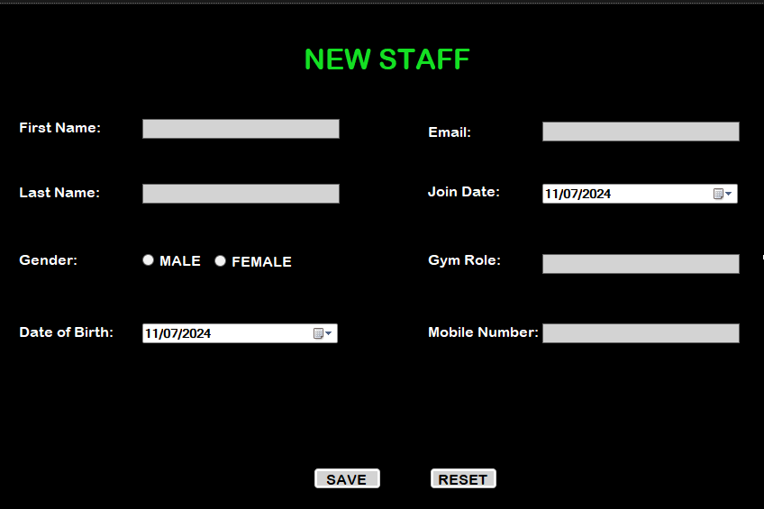
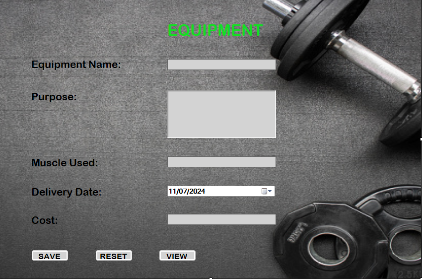
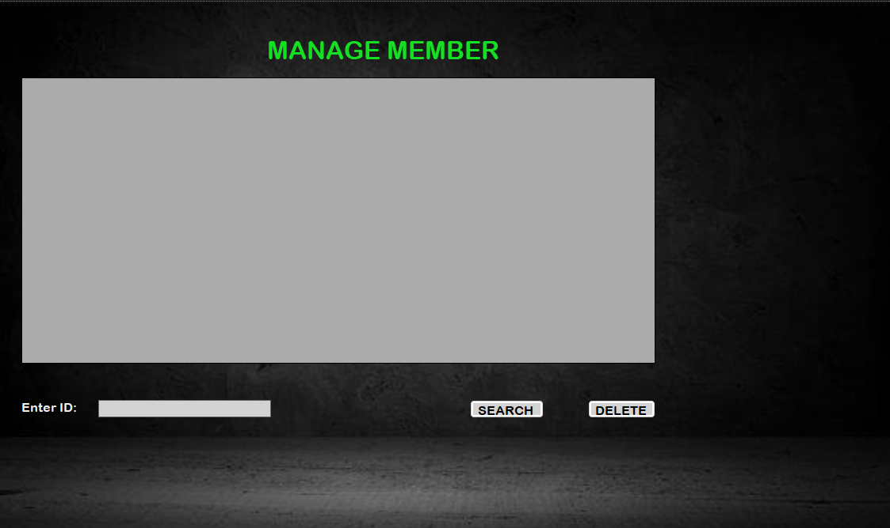
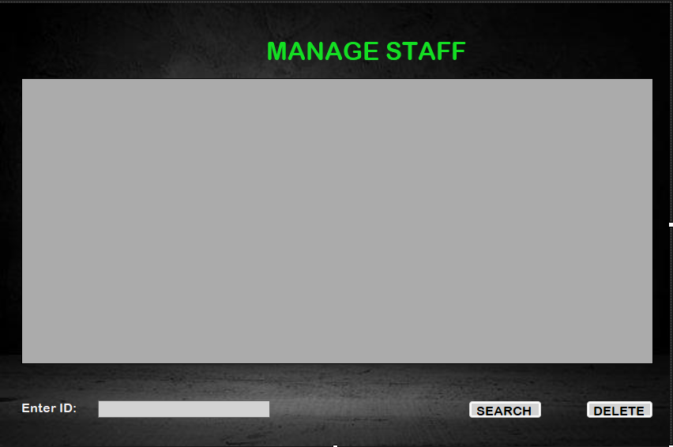
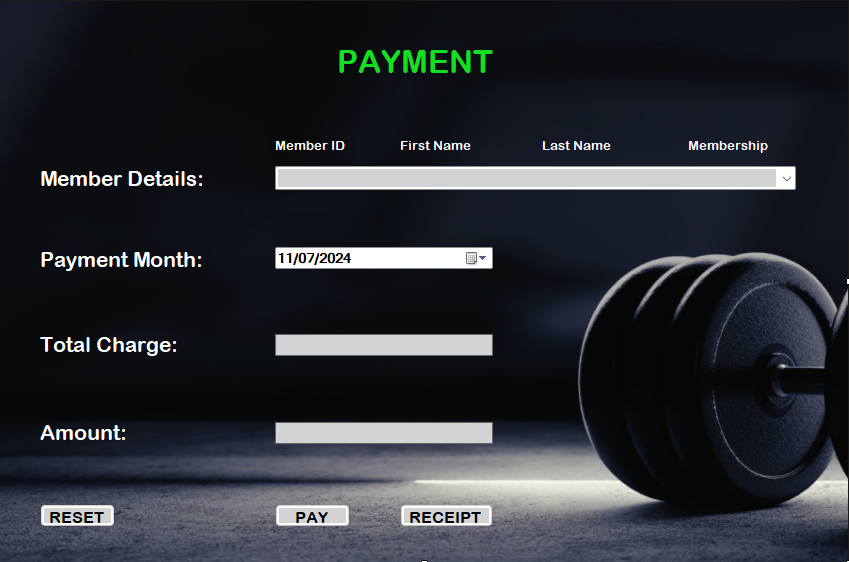
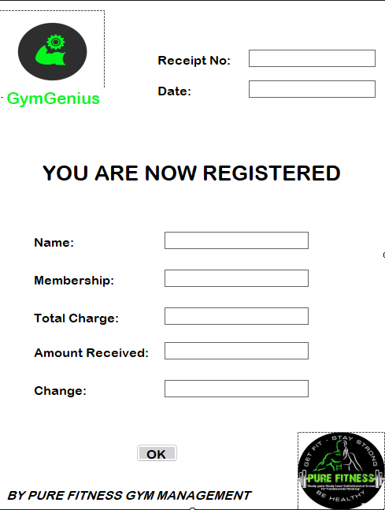

# GymGenius
is an efficient desktop-based gym management system built in C# using the .NET Framework. It can automate and streamline a gym's daily operations, including membership registration, scheduling, payment processing, equipment   management, and customer and gym staff database management.

## Desktop Application User Interface

## Loading Screen

## Login Form

## Dashboard

## Add New Member

## Add New Staff

## Equipment

## Manage Member

## Manage Staff

## Payment

## Receipt

