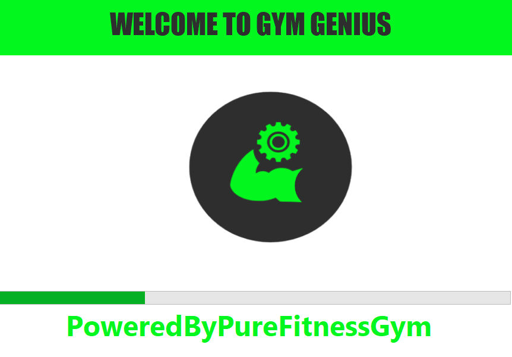
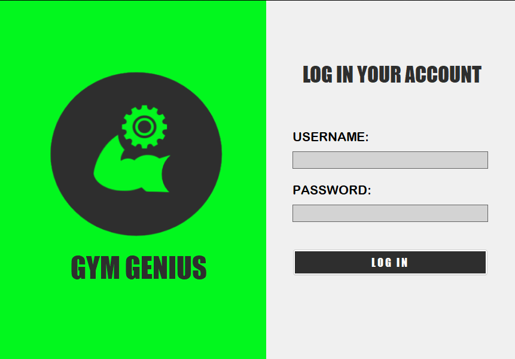
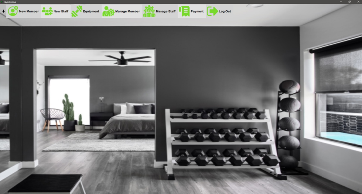
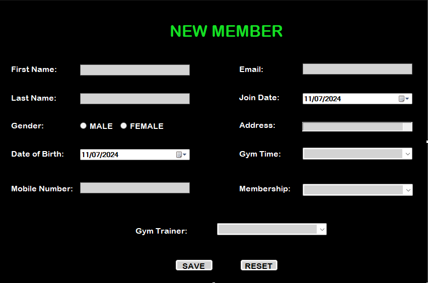
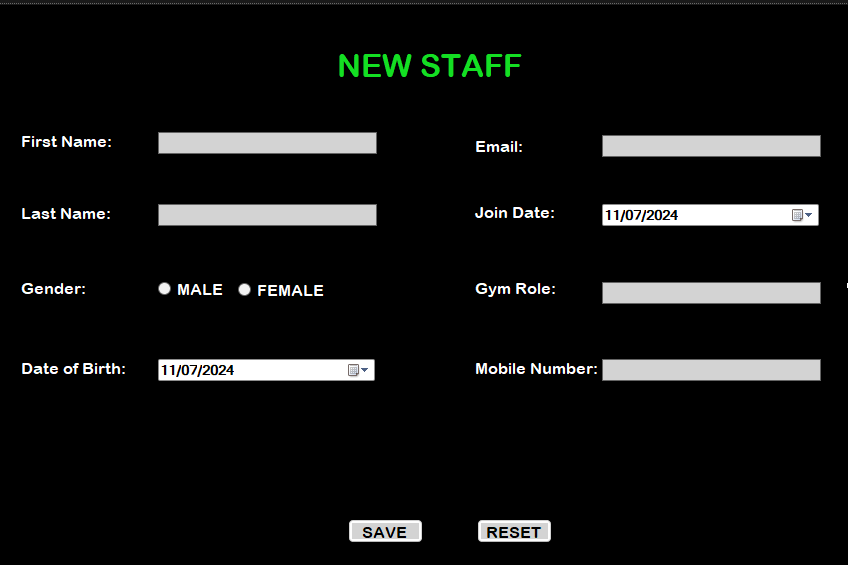
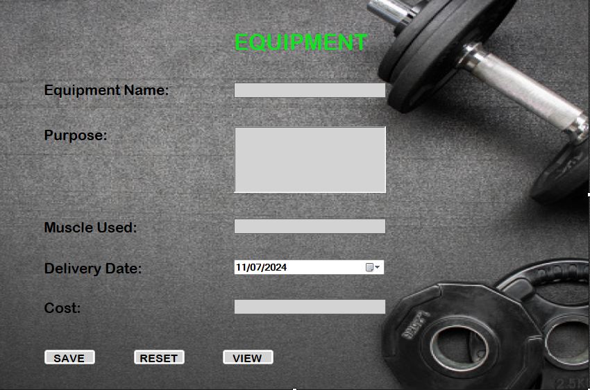
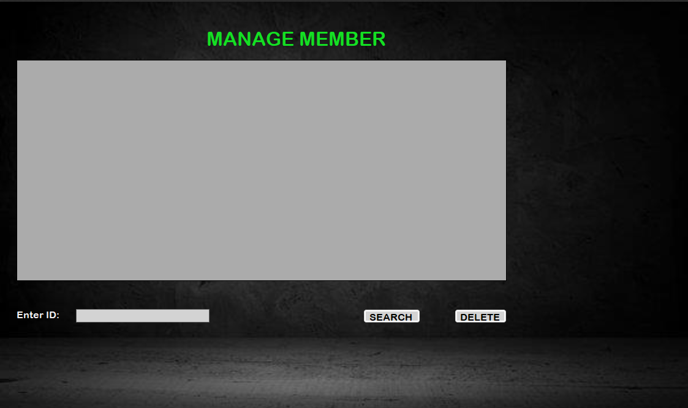
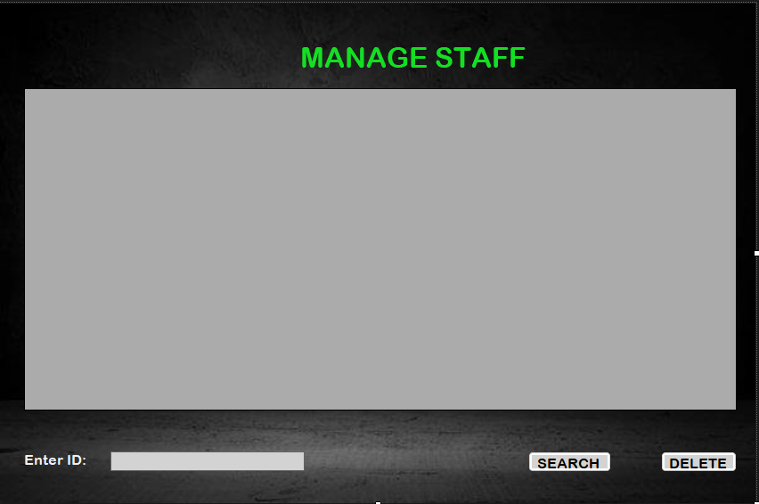
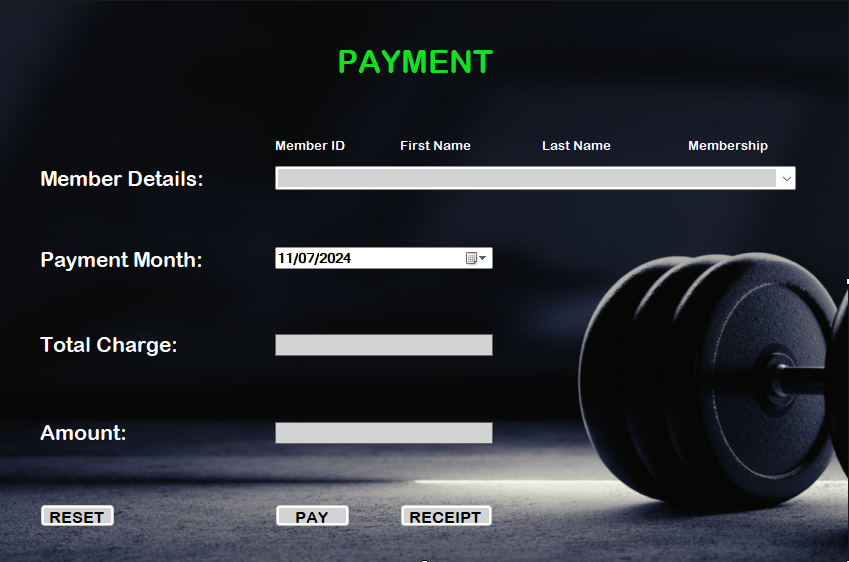
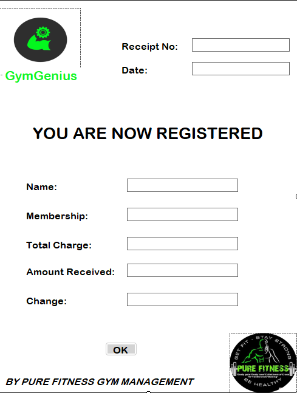

# GymGenius
Desktop-based gym management system built in C# using the .NET Framework. Developed as a final project in CSci 23 - Application Development and Emerging Technologies. It can automate membership registration, scheduling, payment processing, equipment management, and customer and gym staff database management.

### Features of the Application

##### Loading Screen

##### Login Form

##### Dashboard

##### Add New Member

##### Add New Staff

##### Equipment

##### Manage Member

##### Manage Staff

##### Payment

##### Receipt

