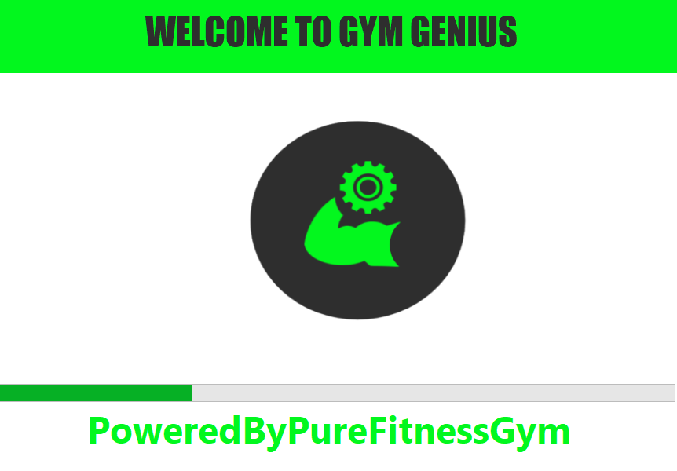
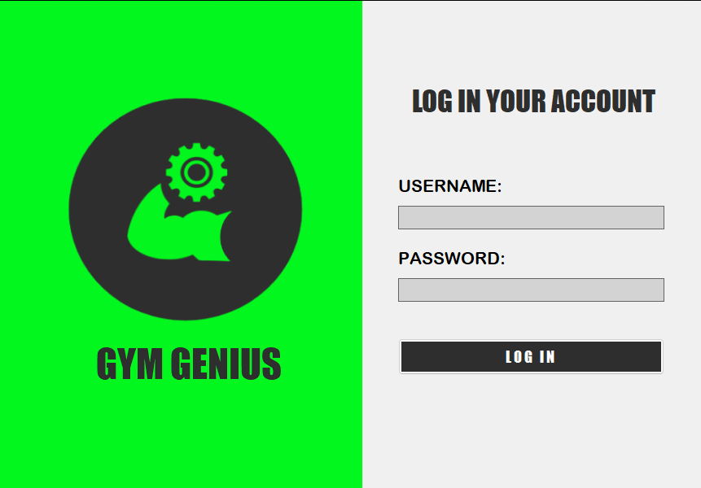
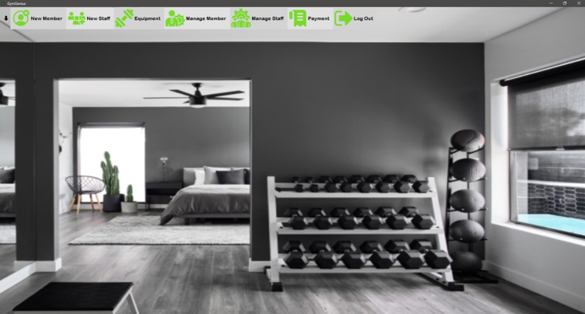
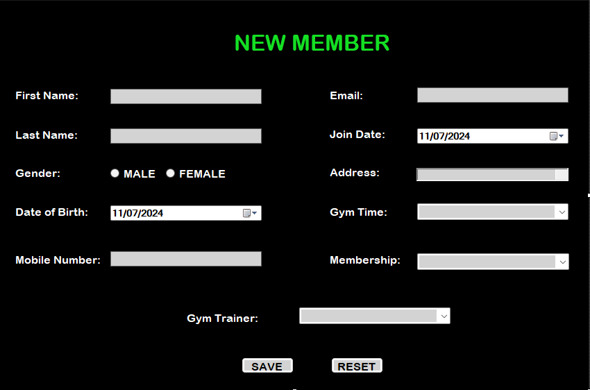
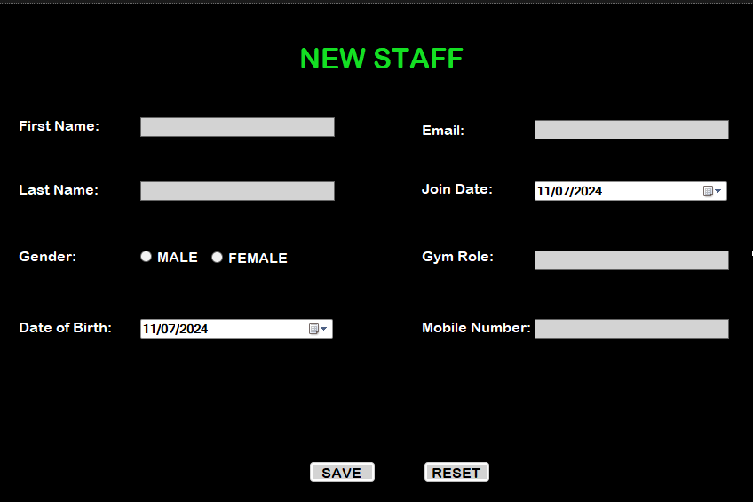
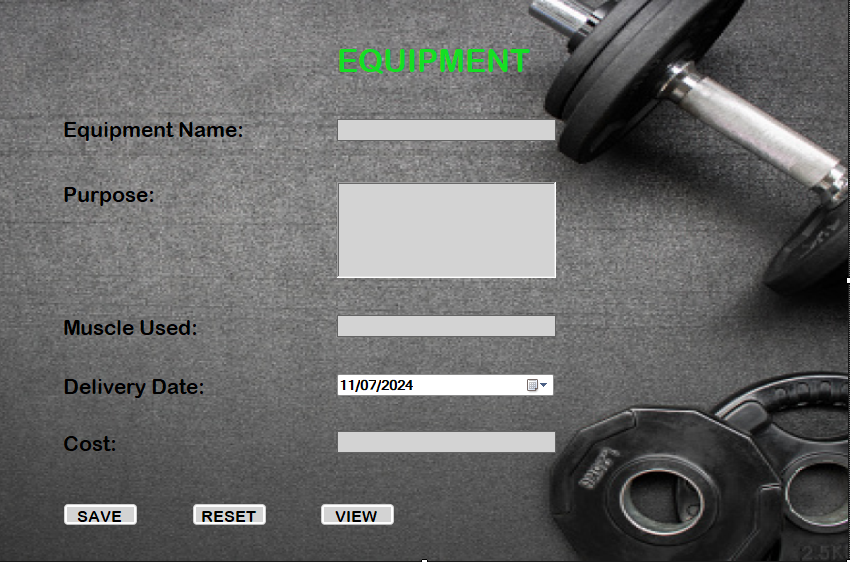
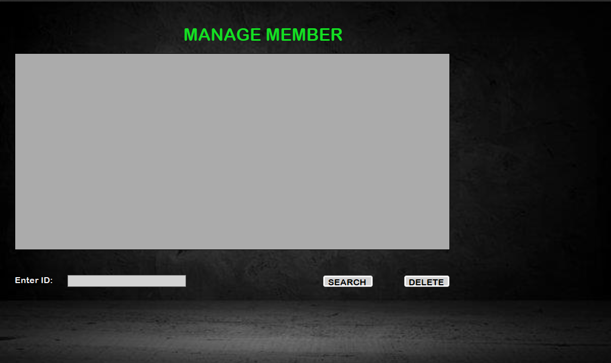
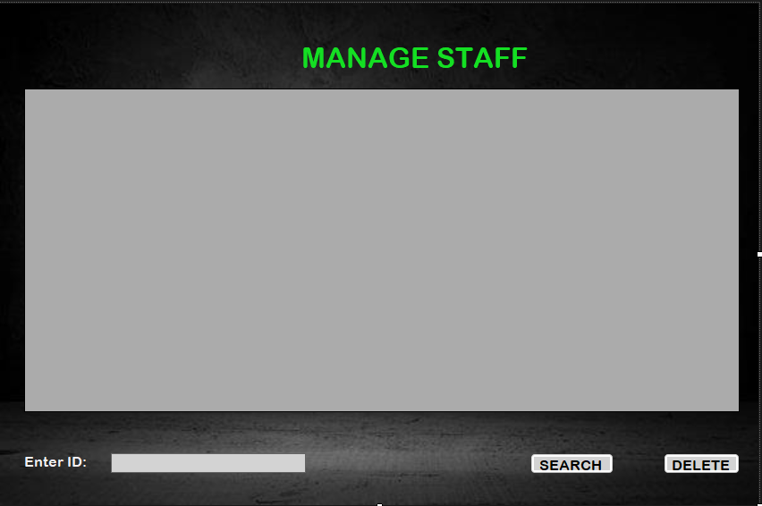
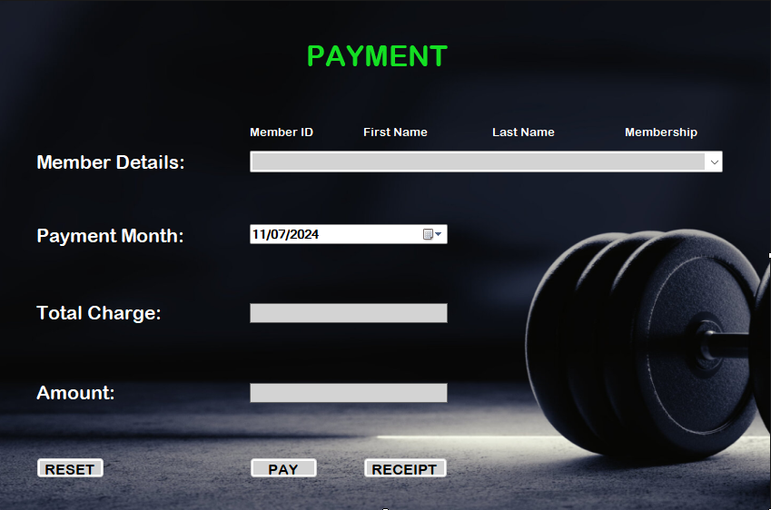
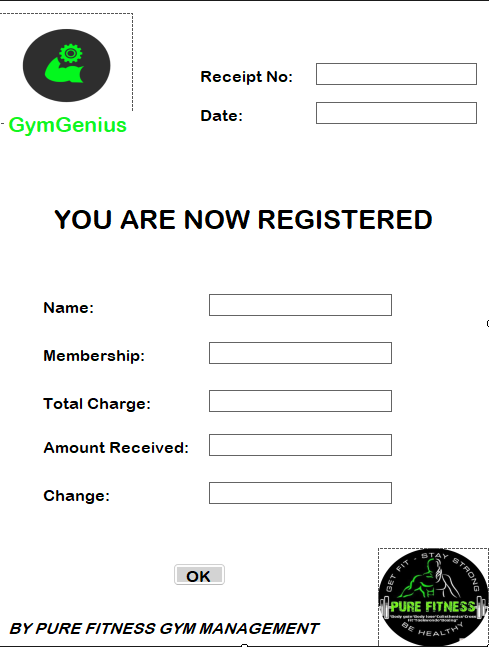

# GymGenius

## 📖 About
GymGenius is an efficient desktop-based gym management system built in C# using the .NET Framework. Developed as a final project in CSci 23 - Application Development and Emerging Technologies. It can automate membership registration, scheduling, payment processing, equipment management, and customer and gym staff database management.

## ✨ Features/Demo
#### Loading Screen


#### Login Form


#### Dashboard


#### Add New Member


#### Add New Staff


#### Equipment


#### Manage Member


#### Manage Staff


#### Payment


#### Receipt


## 🛠️ Tech Stack
* .NET Framework <br>
* C# (Windows Forms) <br>
* Microsoft SQL Server <br>
* Microsoft SQL Server Management Studio <br>
* Microsoft Visual Studio Community 2019 <br>

## ⚙️ Getting Started
### Minimum PC Requirements
* RAM: 4GB <br>
* Processor: Dual-Core <br>
* OS: Windows 7 or Higher <br>
* Hard Disk: Minimum 100GB <br>
### Prerequisites 
* Microsoft Visual Studio Community 2019 <br>
* Microsoft SQL Server Management Studio <br>
### Installation & Run
1. Clone the repository <br>
   &nbsp;&nbsp; `git clone https://github.com/Nin-Onin/GymGenius.git` <br>
   &nbsp;&nbsp; `cd GymGenius`
2. Open the project in Visual Studio <br>
   &nbsp;&nbsp; Open `GymGenius.sln` in Microsoft Visual Studio 2019
3. Set up the database <br>
   &nbsp;&nbsp; Open **SQL Server Management Studio** → Connect to your server <br>
   &nbsp;&nbsp; Open **New Query** and run:
   ```sql
   INSERT INTO Login (Username, Password)
   VALUES ('YourUsername', 'YourPassword');
   ```
4. Run the application <br>
   &nbsp;&nbsp; Press `F5` or click **Start** in Visual Studio

## 🚀 Usage

| Feature | Description |
|---|---|
| New Member | Register a new gym member with personal info and membership plan |
| New Staff | Add gym staff with their role and contact details |
| Equipment | Add, view, search, and delete gym equipment records |
| Manage Member | View all members, search by ID, and delete records |
| Manage Staff | View all staff, search by ID, and delete records |
| Payment | Process member payments and generate receipts |
| Log Out | Exits back to the login screen |
 
### Membership Plans
| Plan | Price (₱) | Gym Trainer |
|---|---|---|
| Session Only | 80 | Not included |
| 1 Month | 2,000 | Included |
| 2 Months | 4,000 | Included |
| 6 Months | 10,000 | Included |
| 12 Months | 15,000 | Included |


## 👤 Author
**Niño M. Austria**
- Course: CSci 23 - Application Development and Emerging Technologies
- GitHub: [@Nin-Onin](https://github.com/Nin-Onin)

